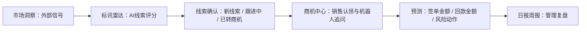

# Market 数据采集中心

Market 是面向 G 端销售与市场团队的 AI 商机发现、销售跟进与经营预测系统。

产品主线不是简单堆模块，而是一条经营闭环：

```text
外部情报 → 线索识别 → 销售认领 → 机器人追问 → 签单预测 → 回款预测 → 管理复盘
```

## 产品结构

- 日报周报：服务管理者掌握团队每天在做什么，自动复盘关键动作、风险商机和外部情报变化。
- 市场洞察：负责外部情报采集、分析和行动建议，包括标讯雷达 Agent、政策与市场跟踪 Agent、竞对监控 Agent、行业知识 Agent 和市场数据采集中心。
- 商机中心：负责线索转商机、机器人与销售对话、商机推进、签单预测和回款预测。
- 管理中心：负责采集源、关键词、模型、账号、钉钉和系统配置。

## 标讯到商机的关系

`标讯雷达 / 线索确认` 属于市场洞察，不是一级中心。它负责从公开采购公告中识别可行动线索，再转入商机中心的证据区。



## 已整合能力

- 后端新增 `opportunity_leads` 线索模型。
- 后端新增 `/api/opportunity-leads` 系列接口。
- 后端新增 G 端公告抓取、解析、评分、价值判断、风险提示和建议动作服务。
- 前端新增市场洞察下的 `标讯线索确认` 页面：`/intelligence/opportunities`。
- 前端重构 `商机中心`：当前展示日报商机动作、已确认标讯线索和销售侧契约缺口；销售认领、机器人追问、签单预测、回款预测必须等待销售侧机制提供数据契约后接入。
- 前端强化 `日报周报`：增加管理者复盘视角。
- 本机 SQLite 启动时会自动补建缺失表，便于直接试用。

## 如何试用

后端：

```bash
cd /Users/xiaoli/Documents/market-product/backend
pip install -r requirements.txt
python3 -m uvicorn app.main:app --reload --host 127.0.0.1 --port 8001
```

前端：

```bash
cd /Users/xiaoli/Documents/market-product/frontend
npm install
npm run dev -- --host 127.0.0.1 --port 8002
```

打开前端地址后登录：

- 用户名由 `ADMIN_USERNAME` 控制，本机未配置时为 `admin`
- 密码由 `ADMIN_PASSWORD` 控制，本机首次试用可使用开发默认值；登录后请立即在管理中心修改。生产部署必须在 `.env` 中设置强密码。

使用路径：

- `01 · 日报周报`：查看团队动作、风险事项和管理复盘。
- `02 · 市场洞察`：查看外部情报，并进入 `标讯线索确认`。
- `03 · 商机中心`：处理线索转商机、机器人追问、签单预测和回款预测。
- `04 · 管理中心`：维护采集、关键词、模型、账号和系统配置。

## 内置采集配置与数据快照

仓库包含一份脱敏后的初始快照：

- 文件：`backend/app/fixtures/market_snapshot.json`
- 内容：118 个采集源、1 组关键词配置、1 组调度配置、359 条市场信号、359 条证据记录、359 条情报事件、94 条标讯线索。
- 不包含：剑鱼账号密码、钉钉密钥、真实 `.env`、本地数据库文件、上传周报 HTML、第三方网页全文。

本地空库导入：

```bash
PYTHONPATH=backend python3 backend/scripts/import_market_snapshot.py
```

重新从本机 SQLite 导出当前快照：

```bash
python3 backend/scripts/export_market_snapshot.py --db backend/market.db
```

## 一键部署

给完全不懂技术的人，优先使用这一条：

```bash
bash install.sh
```

执行后按提示输入：

- 公网域名，例如 `market.company.com`
- HTTPS 证书通知邮箱，例如 `ops@company.com`

脚本会自动完成服务器自检、强密钥生成、安全与质量门禁、容器构建启动、内置采集快照导入和上线冒烟验证。

如果你已经准备好域名和邮箱，也可以一次执行：

```bash
bash install.sh --domain market.company.com --email ops@company.com
```

部署完成后访问：

```text
https://你的域名
```

后续你把新代码覆盖到服务器项目目录后，只需要执行：

```bash
./deploy/marketctl.sh update
```

更新会自动备份数据库、运行安全与质量门禁，通过后再替换服务。

服务器只需要提前准备好：

- 一台 Linux 服务器。
- 域名已经解析到这台服务器。
- 防火墙或安全组开放 `80` 和 `443`。
- 服务器安装 Docker 和 Docker Compose 插件。
- 不需要在服务器额外安装 Node.js 或项目 Python 依赖；前后端构建在 Docker 里完成。

生产部署只暴露公网 `80/443`，数据库和后端端口不会直接暴露到服务器外部。

## 内网部署与公网发布

生产部署请使用 `deploy/` 工具包，不使用根目录本地试用 compose。

第一次部署：

```bash
./deploy/marketctl.sh init --domain market.company.com --email ops@company.com
```

这一步会自动生成根目录 `.env`：

- 自动生成数据库密码、登录密钥、运行时密钥、初始管理员密码和上传 Key。
- 自动写入公网域名、证书邮箱和 CORS 允许来源。
- 自动执行公网安全门禁；示例域名、IP、localhost 和弱密钥会被拒绝。

上线前先跑服务器自检和门禁：

```bash
./deploy/marketctl.sh doctor
./deploy/marketctl.sh gate
```

启动生产服务：

```bash
./deploy/marketctl.sh up
```

验证服务是否可用：

```bash
./deploy/marketctl.sh smoke
```

导入仓库内置的脱敏采集配置和已抓取市场数据：

```bash
./deploy/marketctl.sh seed-snapshot
```

后续代码更新：

```bash
./deploy/marketctl.sh update
```

`update` 会先备份数据库，再执行安全与质量门禁，通过后重建并替换容器。生产部署只暴露公网 `80/443`，数据库和后端端口不会发布到宿主机。

生成可拷贝到服务器的部署包：

```bash
./deploy/marketctl.sh pack
```
